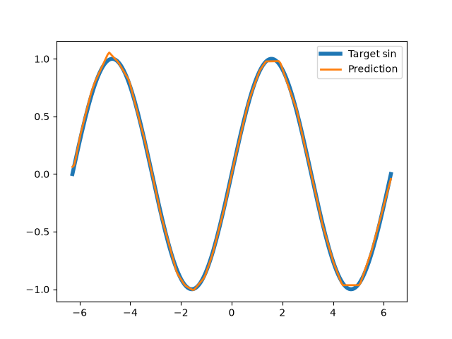

# minigrad
A 'mini' grad engine for educational purposes.
To understand how it works read the code.

## How to get going
1) Create a virtual environment (unix / linux):
```bash
python -m venv venv && source venv/bin/activate
```

2) Get the latest version of pip:
```bash
pip install --upgrade pip
```

3) Install the requirements:
```bash
pip install -r requirements.txt
```

And you're all set, for now at least...

## How to actually use it
minigrad is a 'mini' deep learning library (but for educational purposes and mostly for playing around).
Try for example to fit a sine curve (you can find the same code in the examples):
```python
"""
Fitting a sine curve using minigrad
"""
from minigrad import Tensor 
from minigrad.nn import function as f 
from minigrad.nn import Model
from minigrad.nn import optim

import numpy as np
import matplotlib.pyplot as plt

# create training data
np.random.seed(0)

X = Tensor(np.linspace(-2 * np.pi, 2 * np.pi, 200).reshape(-1, 1))
y = Tensor(np.sin(X.data))

# define a model
model = Model(X, y, optimizer=optim.Adam)
model.create_layer(nin=1, nout=64, activation=f.Relu)
model.create_layer(nin=64, nout=64, activation=f.Relu)
model.create_layer(nin=64, nout=1)

def plot_fitted_curve():
    y_pred = model.forward(X)
    # plot 
    fix, ax = plt.subplots()
    ax.plot(X.data, y.data, label="Target sin", lw=4)
    ax.plot(X.data, y_pred.data, label="Prediction", lw=2)
    ax.legend()
    plt.show()

if __name__ == "__main__":
    model.train(lr=0.01, batch_size=64, epochs=10000, debug=True)
    plot_fitted_curve()
```
And here you have a sine curve:


Or just run the (same) example:
```bash
PYTHONPATH="." python examples/sin_example
```

## Testing
There is a testing suite (in progress).
To run it, run the following:
```bash
python -m unittest discover -s tests
```

To run with coverage, run the following:
```bash
coverage run -m unittest discover -s tests 
```

And last but not least... Have fun!